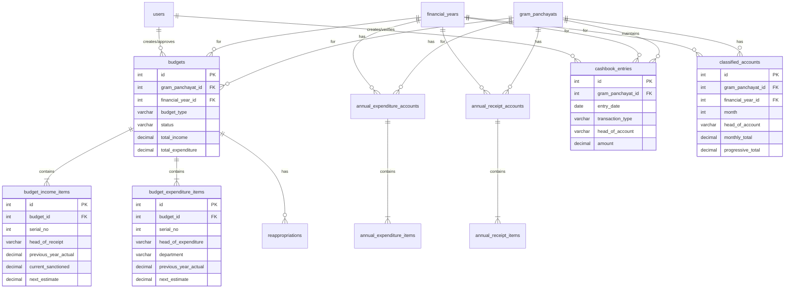
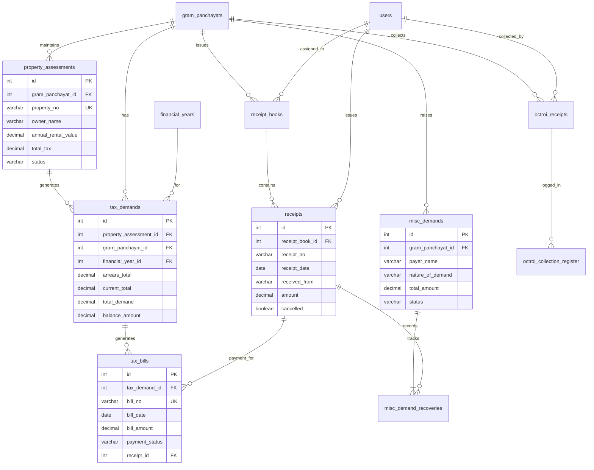
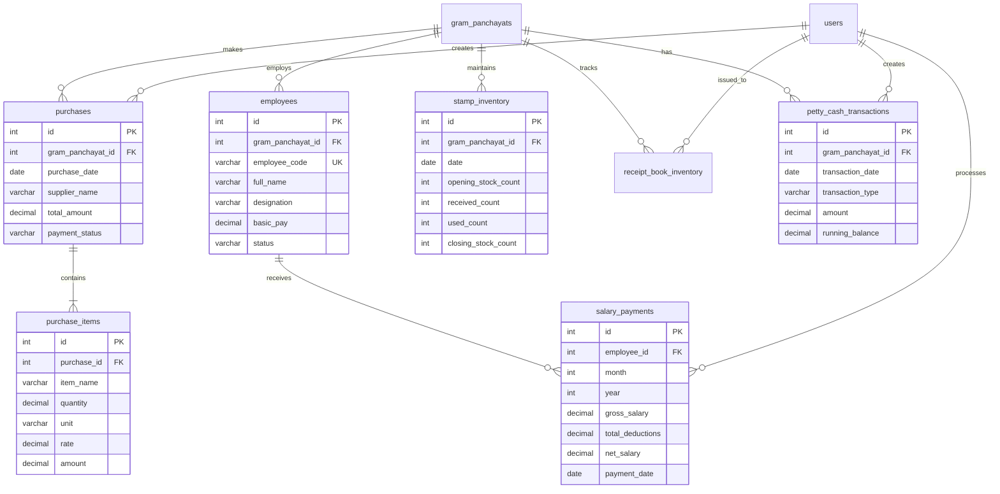
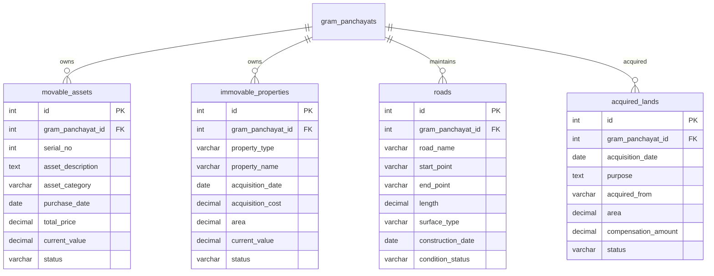
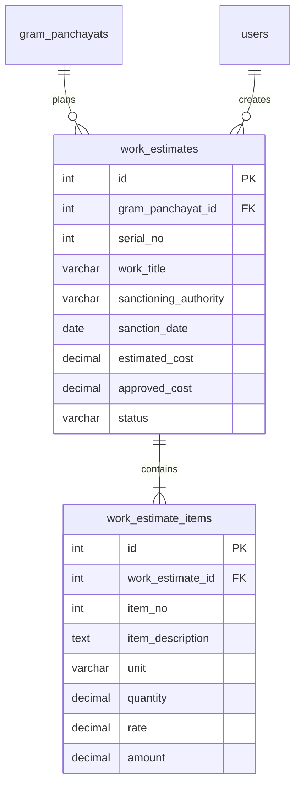
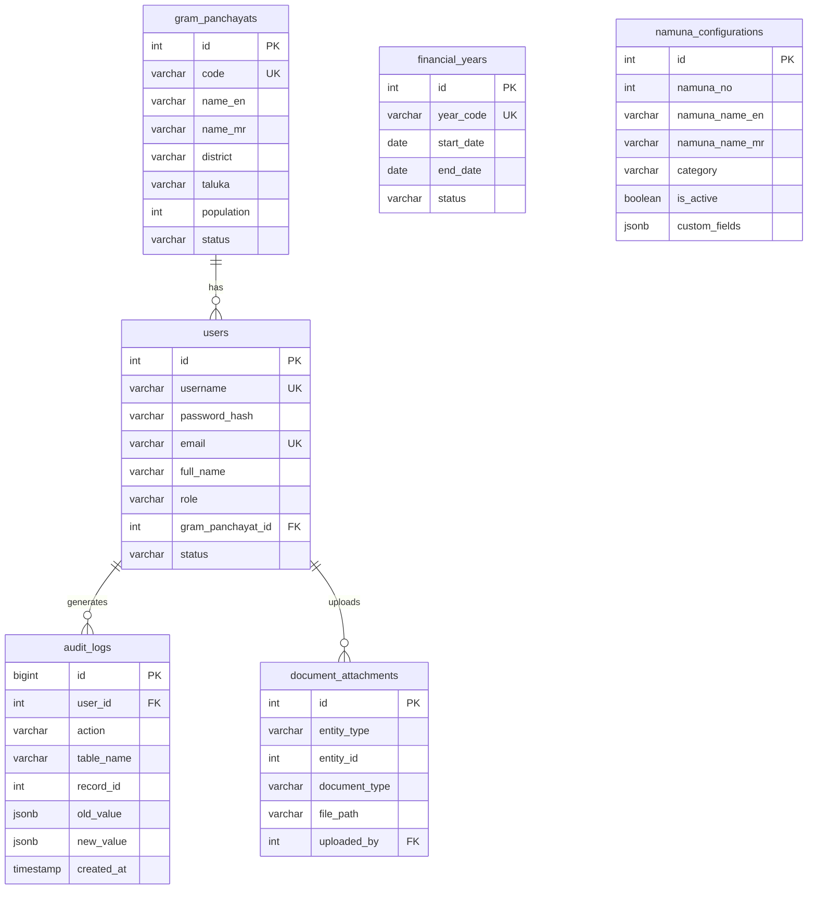
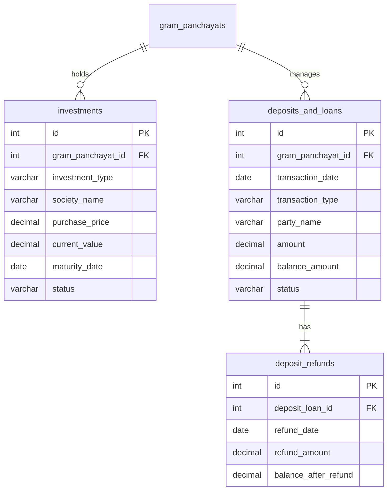
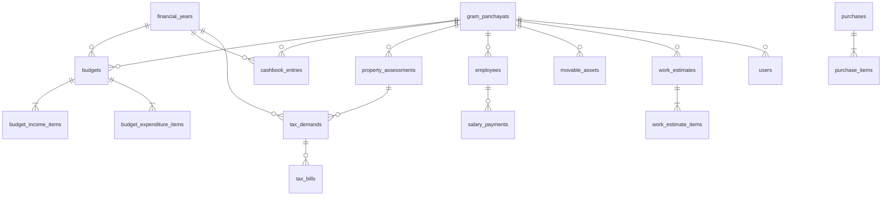

# Entity Relationship Diagrams (ERD)
## Gram Panchayat Namunas System

This document contains visual database relationship diagrams for all modules in the system.

---

## 1. Financial Management Module (Nam unas 1-6)

---

## 2. Revenue Collection Module (Namunas 7-13)

---

## 3. Operations Module (Namunas 15-18, 21, 24)

---

## 4. Asset Management Module (Namunas 19, 25-27)

---

## 5. Project Management Module (Namuna 23)

---

## 6. Core System Tables

---

## 7. Investment & Deposits Module (Namuna 20 + Investments)

---

## 8. Complete System Overview

---

## Key Relationships Summary

### One-to-Many Relationships

| Parent Table | Child Table | Relationship |
|--------------|-------------|--------------|
| `gram_panchayats` | Most tables | Each GP has multiple records |
| `financial_years` | Financial tables | Each year has multiple budget records |
| `budgets` | `budget_income_items` | Each budget has multiple income lines |
| `budgets` | `budget_expenditure_items` | Each budget has multiple expenditure lines |
| `property_assessments` | `tax_demands` | Each property generates yearly demands |
| `tax_demands` | `tax_bills` | Each demand can have multiple bills |
| `employees` | `salary_payments` | Each employee has monthly salary records |
| `purchases` | `purchase_items` | Each purchase has multiple items |
| `work_estimates` | `work_estimate_items` | Each work has multiple line items |

### Many-to-One Relationships

| Child Table | Parent Table | Purpose |
|-------------|--------------|---------|
| Most tables | `users` | Track who created/modified records |
| Most tables | `gram_panchayats` | Link records to specific GP |
| Financial tables | `financial_years` | Year-wise data segregation |

### Special Relationships

- **Receipts ↔ Tax Bills**: When tax is paid, receipt links to bill
- **Cashbook ↔ Classified Accounts**: Same transactions in different views
- **Budget ↔ Annual Accounts**: Budget is plan, annual account is actual
- **Audit Logs**: Polymorphic relationship to all tables (via table_name + record_id)
- **Document Attachments**: Polymorphic relationship (via entity_type + entity_id)

---

## Database Normalization Notes

The schema follows **3rd Normal Form (3NF)** with some denormalization for performance:

### Normalized Aspects:
- Master data in separate tables (gram_panchayats, financial_years, users)
- Line items separated from headers (budget_items, purchase_items, etc.)
- Lookup values use consistent VARCHAR constraints

### Strategic Denormalization:
- `total_income` and `total_expenditure` stored in budgets table (calculated fields)
- `balance_amount` stored in tax_demands (for quick queries)
- `monthly_total` and `progressive_total` in classified_accounts (aggregates)
- Daily columns (day_1 to day_31) in classified_accounts (performance optimization)

### Justification:
- Reduces complex JOINs for frequently accessed totals
- Improves query performance for reports
- Trade-off: Requires triggers/application logic to keep synchronized
