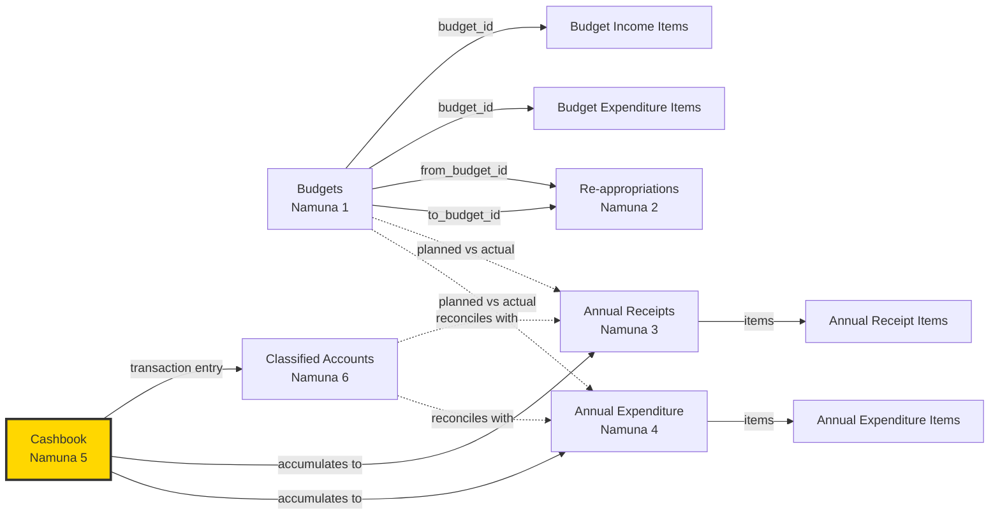
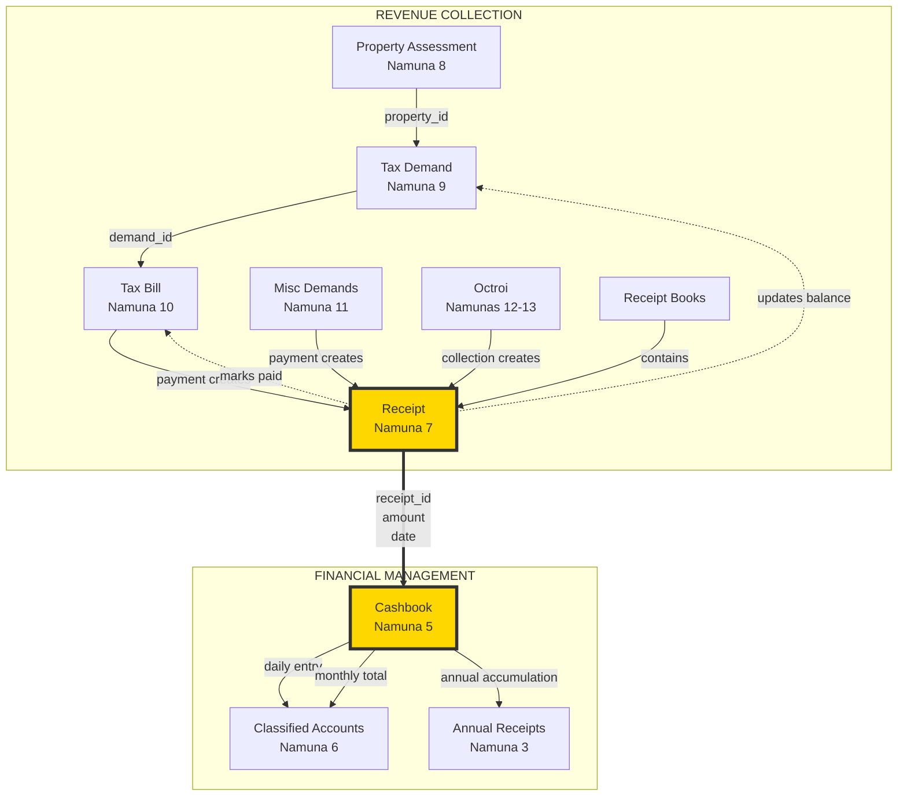
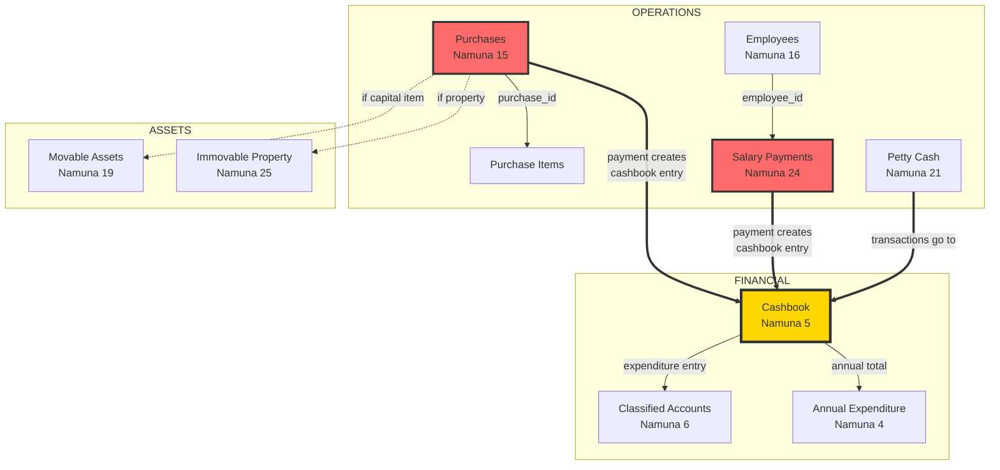
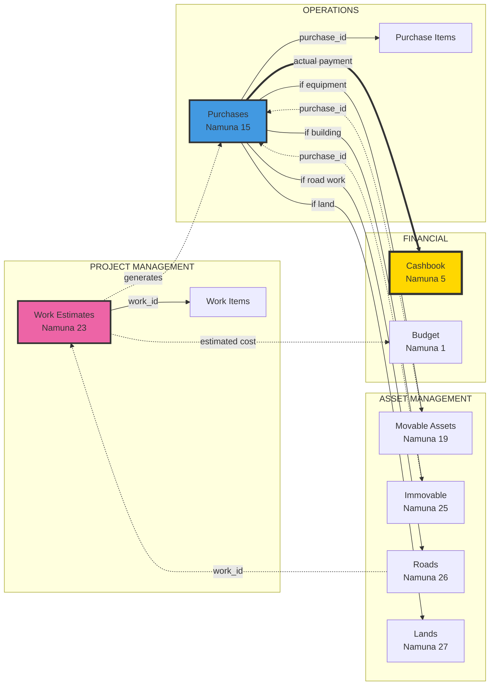
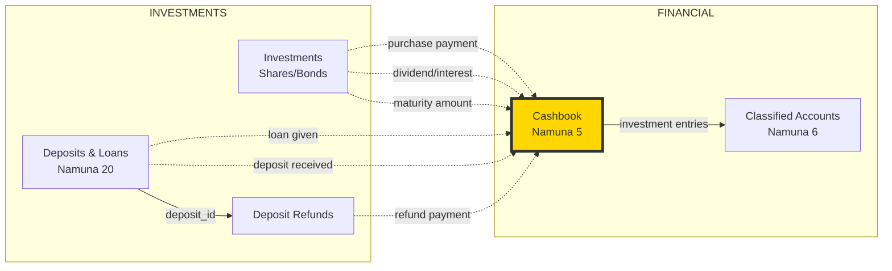
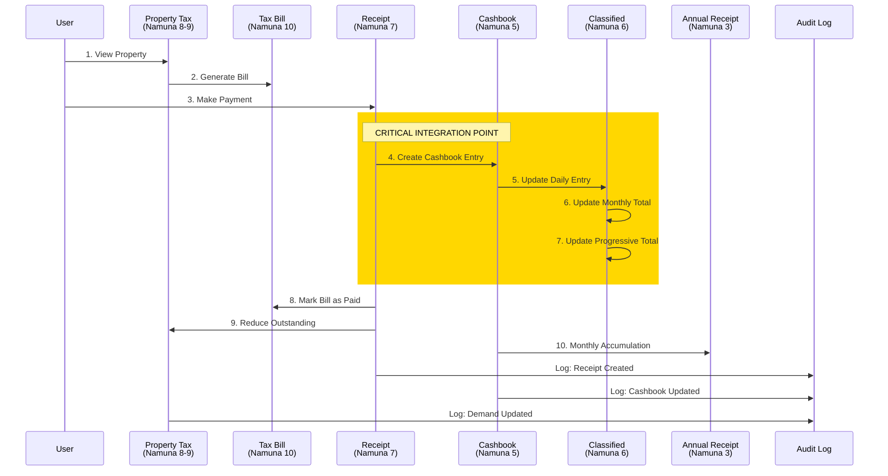
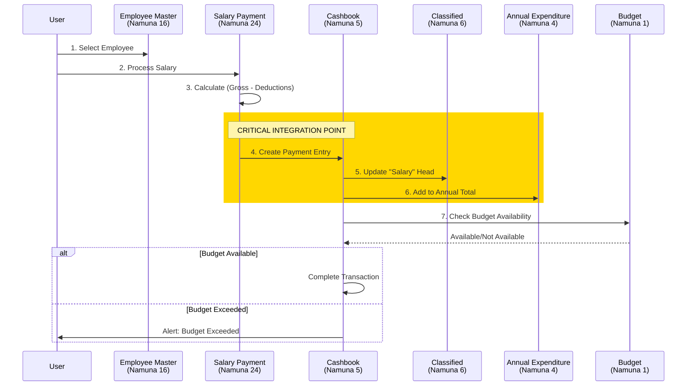
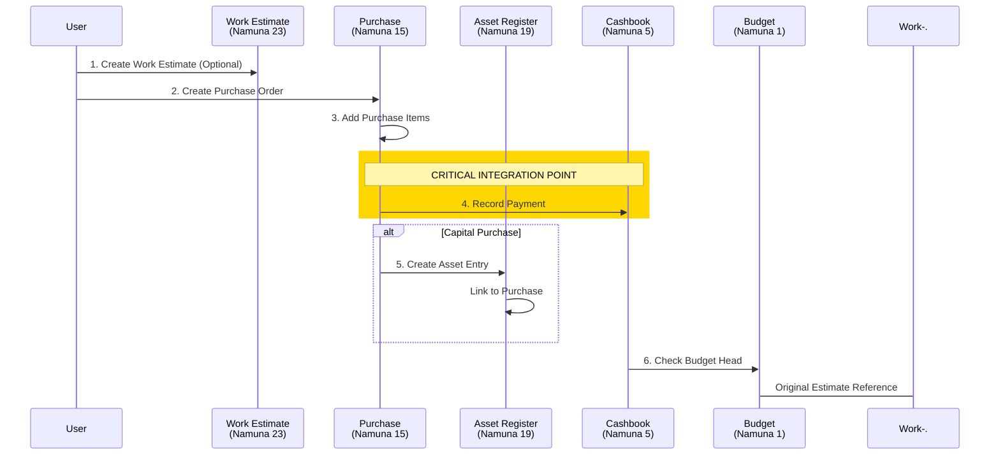

# Complete System Interconnections
## Gram Panchayat Namunas System - Every Connection Mapped

---

## 🔗 Master Interconnection Map

### Core → All Modules Connections

Every module depends on these core tables:

```mermaid
graph TB
    subgraph CORE["CORE INFRASTRUCTURE"]
        GP[(Gram Panchayats)]
        FY[(Financial Years)]
        USERS[(Users)]
        AUDIT[(Audit Logs)]
        DOCS[(Documents)]
    end
    
    subgraph FINANCIAL["FINANCIAL - 10 Tables"]
        F1[Budgets]
        F2[Budget Items]
        F3[Reappropriations]
        F4[Cashbook Entries]
        F5[Classified Accounts]
        F6[Annual Accounts]
    end
    
    subgraph REVENUE["REVENUE - 10 Tables"]
        R1[Receipts]
        R2[Receipt Books]
        R3[Property Assessments]
        R4[Tax Demands]
        R5[Tax Bills]
        R6[Misc Demands]
        R7[Octroi]
    end
    
    subgraph OPERATIONS["OPERATIONS - 9 Tables"]
        O1[Purchases]
        O2[Purchase Items]
        O3[Employees]
        O4[Salary Payments]
        O5[Stamp Inventory]
        O6[Petty Cash]
    end
    
    subgraph ASSETS["ASSETS - 4 Tables"]
        A1[Movable Assets]
        A2[Immovable Properties]
        A3[Roads]
        A4[Acquired Lands]
    end
    
    subgraph PROJECTS["PROJECTS - 2 Tables"]
        P1[Work Estimates]
        P2[Work Items]
    end
    
    subgraph INVESTMENTS["INVESTMENTS - 3 Tables"]
        I1[Investments]
        I2[Deposits & Loans]
        I3[Deposit Refunds]
    end
    
    %% Core to All Modules
    GP -->|gram_panchayat_id| F1
    GP -->|gram_panchayat_id| F4
    GP -->|gram_panchayat_id| F5
    GP -->|gram_panchayat_id| F6
    
    GP -->|gram_panchayat_id| R1
    GP -->|gram_panchayat_id| R2
    GP -->|gram_panchayat_id| R3
    GP -->|gram_panchayat_id| R4
    GP -->|gram_panchayat_id| R6
    GP -->|gram_panchayat_id| R7
    
    GP -->|gram_panchayat_id| O1
    GP -->|gram_panchayat_id| O3
    GP -->|gram_panchayat_id| O5
    GP -->|gram_panchayat_id| O6
    
    GP -->|gram_panchayat_id| A1
    GP -->|gram_panchayat_id| A2
    GP -->|gram_panchayat_id| A3
    GP -->|gram_panchayat_id| A4
    
    GP -->|gram_panchayat_id| P1
    GP -->|gram_panchayat_id| I1
    GP -->|gram_panchayat_id| I2
    
    FY -->|financial_year_id| F1
    FY -->|financial_year_id| F4
    FY -->|financial_year_id| F5
    FY -->|financial_year_id| F6
    FY -->|financial_year_id| R4
    
    USERS -->|created_by/approved_by| F1
    USERS -->|issued_by| R1
    USERS -->|processed_by| O4
    
    AUDIT -.->|tracks all changes| FINANCIAL
    AUDIT -.->|tracks all changes| REVENUE
    AUDIT -.->|tracks all changes| OPERATIONS
    
    classDef coreStyle fill:#667eea,stroke:#333,stroke-width:3px,color:#fff
    classDef finStyle fill:#48bb78,stroke:#333,stroke-width:2px
    classDef revStyle fill:#f6ad55,stroke:#333,stroke-width:2px
    classDef opsStyle fill:#4299e1,stroke:#333,stroke-width:2px
    classDef assetStyle fill:#9f7aea,stroke:#333,stroke-width:2px
    classDef projStyle fill:#ed64a6,stroke:#333,stroke-width:2px
    classDef invStyle fill:#38b2ac,stroke:#333,stroke-width:2px
    
    class GP,FY,USERS,AUDIT,DOCS coreStyle
    class F1,F2,F3,F4,F5,F6 finStyle
    class R1,R2,R3,R4,R5,R6,R7 revStyle
    class O1,O2,O3,O4,O5,O6 opsStyle
    class A1,A2,A3,A4 assetStyle
    class P1,P2 projStyle
    class I1,I2,I3 invStyle
```



---

## 💰 Financial Module - Complete Internal Connections



---

## 💵 Revenue → Financial Integration



**KEY INTEGRATION**: Every receipt (from any source) MUST create a cashbook entry!

---

## 🏢 Operations → Financial Integration



**KEY INTEGRATION**: All expenditures (purchases, salaries, petty cash) flow to cashbook!

---

## 🔨 Projects → Operations → Assets Integration



**KEY INTEGRATION**: Projects → Purchases → Assets + Cashbook

---

## 💎 Investments → Financial Integration



**KEY INTEGRATION**: All investment transactions flow through cashbook!

---

## 🌊 Complete Data Flow - Transaction Example

### Tax Payment Complete Flow



### Salary Payment Complete Flow



### Purchase Complete Flow



---

## 📊 Cross-Module Dependency Matrix

| Source Module | Target Module | Integration Type | Key Tables |
|--------------|---------------|------------------|------------|
| **Revenue** → Financial | Data Flow | All receipts create cashbook entries | receipts → cashbook_entries |
| **Operations** → Financial | Data Flow | All payments create cashbook entries | purchases, salaries → cashbook_entries |
| **Projects** → Operations | Trigger | Work estimates generate purchases | work_estimates → purchases |
| **Operations** → Assets | Data Flow | Capital purchases create assets | purchases → movable_assets |
| **Investments** → Financial | Data Flow | All transactions via cashbook | investments → cashbook_entries |
| **Financial** → Financial | Calculation | Cashbook feeds classified & annual | cashbook → classified → annual |
| **Core** → All | Reference | Master data for all transactions | gram_panchayats, users, financial_years |
| **All** → Audit | Logging | Every change tracked | all tables → audit_logs |

---

## 🔑 Critical Integration Points

### 1. CASHBOOK (Namuna 5) - The Delta Hub
**Connected to**: ALL modules with financial transactions

```
Receipts (N7) ────┐
Property Tax (N10) ┤
Misc Demands (N11) ┤
Octroi (N12-13) ──┤
                  ├──> CASHBOOK ──┬──> Classified (N6)
Purchases (N15) ──┤                ├──> Annual Receipts (N3)
Salaries (N24) ───┤                └──> Annual Expenditure (N4)
Petty Cash (N21) ─┤
Investments (N20) ┘
```

### 2. GRAM PANCHAYATS - The Root Table
**Connected to**: Every transaction table

All 40+ transaction tables have `gram_panchayat_id` foreign key

### 3. FINANCIAL YEARS - The Time Dimension
**Connected to**: All time-series data

Budgets, cashbook, demands, annual accounts all linked by `financial_year_id`

### 4. USERS - The Actor Tracking
**Connected to**: Created/Modified records

Tracks who created, approved, verified each record across all modules

### 5. AUDIT LOGS - The Change History
**Connected to**: Every table (polymorphic)

Captures old_value and new_value for all CREATE/UPDATE/DELETE operations

---

## 🎯 Integration Rules

### Rule 1: Single Source of Truth
- **Property Tax** master is in `property_assessments`
- **Employee** master is in `employees`
- **Asset** master is in respective asset tables
- **Financial Year** master is in `financial_years`

### Rule 2: Mandatory Cashbook Entry
Every financial transaction MUST create a cashbook entry:
- Receipt → Cashbook (income)
- Purchase → Cashbook (expenditure)
- Salary → Cashbook (expenditure)
- Investment → Cashbook (income/expenditure)

### Rule 3: Balance Updates
When a receipt is created for a tax bill:
1. Create receipt record
2. Create cashbook entry
3. Update tax_demand.balance_amount
4. Update tax_bill.payment_status
5. All in ONE database transaction

### Rule 4: Audit Everything
Every INSERT, UPDATE, DELETE must create audit_log entry:
- user_id
- table_name
- record_id
- old_value (JSON)
- new_value (JSON)
- timestamp

### Rule 5: Document Attachment
Any record can have attachments via polymorphic relationship:
- entity_type (e.g., "receipt", "purchase")
- entity_id (record ID)
- file_path

---

## 🔄 Circular Dependencies (Avoided)

### Resolved Circular References

❌ **Avoided**: Budget ↔ Cashbook circular dependency
✅ **Solution**: Budget references are soft (comparison only), not foreign keys

❌ **Avoided**: Receipt ↔ Tax Bill circular
✅ **Solution**: Receipt has optional reference to bill, bill gets updated after receipt creation

❌ **Avoided**: Purchase ↔ Asset circular
✅ **Solution**: Asset references purchase (one direction only)

---

## 📈 Integration Validation Checklist

When implementing, validate these connections:

- [ ] Every receipt creates exactly ONE cashbook entry
- [ ] Cashbook total = Sum of all receipts + deposits - (purchases + salaries)
- [ ] Tax demand balance = Total - Sum(receipts for this demand)
- [ ] Classified account monthly total = Sum(cashbook entries for that month)
- [ ] Annual accounts = Sum(cashbook entries for entire year)
- [ ] Budget comparison: Planned vs (Cashbook actual)
- [ ] Asset register: Capital purchases show in assets
- [ ] All tables have gram_panchayat_id
- [ ] All financial tables have financial_year_id
- [ ] All audit actions logged

---

## Summary

### Total Connections
- **Core to Modules**: 40+ foreign key relationships
- **Inter-Module**: 15+ cross-module integrations
- **Internal Module**: 30+ intra-module relationships
- **Total Relationships**: **100+ table relationships**

### Central Hub Tables
1. **gram_panchayats** - Links ALL modules
2. **cashbook_entries** - Links ALL financial transactions
3. **users** - Links ALL user actions
4. **financial_years** - Links ALL time-series data
5. **audit_logs** - Links ALL changes

### Data Flow Paths
- Revenue Collection → Cashbook → Classified → Annual Accounts
- Operations → Cashbook → Annual Expenditure
- Projects → Purchases → Assets + Cashbook
- Budget → (Comparison) → Annual Accounts
- Investments → Cashbook → Classified
