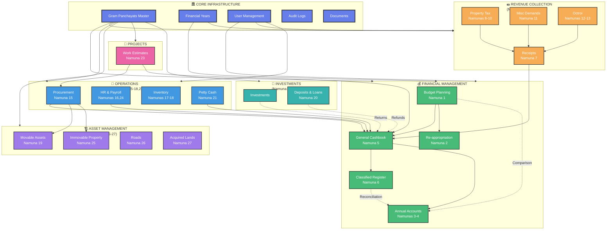
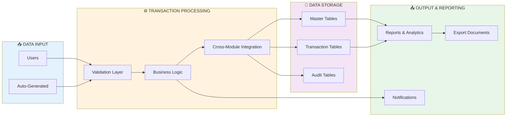
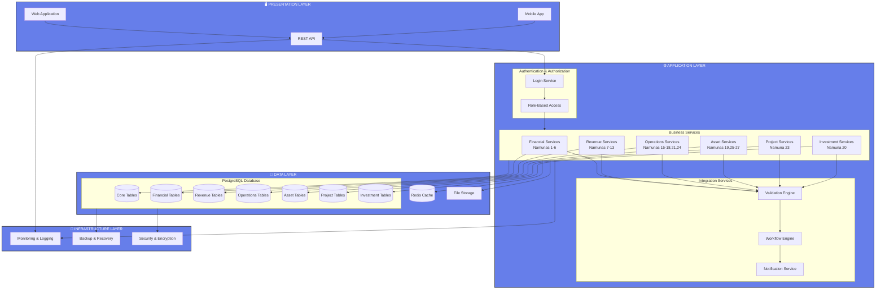
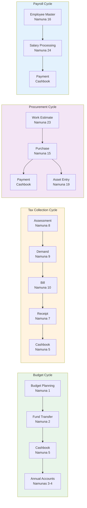
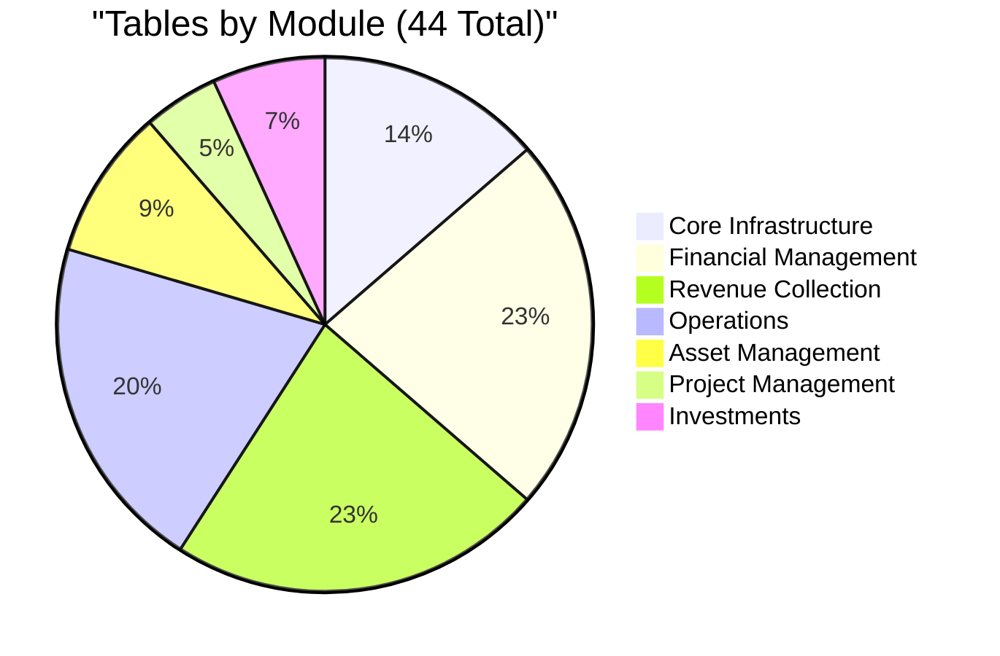
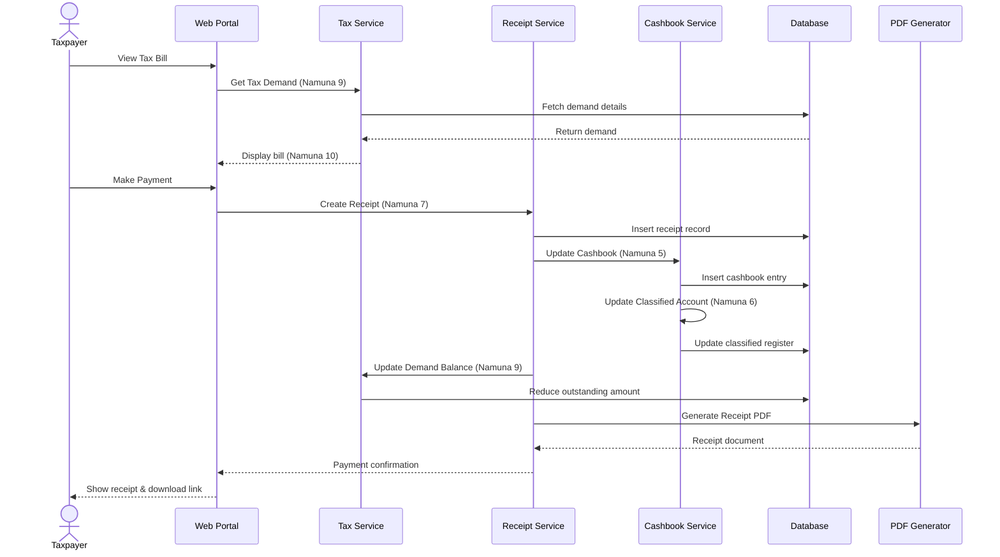

# System Architecture Overview
## Gram Panchayat Namunas System - Complete Visual Guide

---

## 1. System Hierarchy Tree

```
Gram Panchayat Namunas System
│
├── 🏛️ CORE INFRASTRUCTURE
│   ├── Master Data Management
│   │   ├── Gram Panchayats Registry
│   │   ├── Financial Years
│   │   └── Namuna Configurations
│   │
│   ├── User & Security
│   │   ├── User Management
│   │   ├── Role-Based Access Control
│   │   └── Authentication & Authorization
│   │
│   └── System Services
│       ├── Audit Logging
│       ├── Document Attachments
│       └── Notifications
│
├── 💰 FINANCIAL MANAGEMENT MODULE (Namunas 1-6)
│   ├── Budget Management (Namuna 1)
│   │   ├── Annual Budget Preparation
│   │   ├── Income Estimation
│   │   ├── Expenditure Planning
│   │   └── Budget Approval Workflow
│   │
│   ├── Fund Management (Namuna 2)
│   │   └── Re-appropriation (Fund Transfer)
│   │
│   ├── Annual Accounts (Namunas 3-4)
│   │   ├── Expenditure Account
│   │   └── Receipt Account
│   │
│   ├── Daily Transactions (Namuna 5)
│   │   └── General Cashbook
│   │
│   └── Financial Reporting (Namuna 6)
│       └── Classified Accounts Register
│
├── 💵 REVENUE COLLECTION MODULE (Namunas 7-13)
│   ├── Receipt Management (Namuna 7)
│   │   ├── Receipt Book Inventory
│   │   ├── Receipt Generation
│   │   └── Receipt Tracking
│   │
│   ├── Property Tax System (Namunas 8-10)
│   │   ├── Property Assessment (Namuna 8)
│   │   ├── Tax Demand Register (Namuna 9)
│   │   └── Tax Bill Generation (Namuna 10)
│   │
│   ├── Other Collections (Namuna 11)
│   │   └── Miscellaneous Demands & Recovery
│   │
│   └── Octroi System (Namunas 12-13)
│       ├── Octroi Receipt (Namuna 12)
│       └── Collection Register (Namuna 13)
│
├── 🏢 OPERATIONS MODULE (Namunas 15-18, 21, 24)
│   ├── Procurement (Namuna 15)
│   │   ├── Purchase Orders
│   │   ├── Vendor Management
│   │   └── Purchase Tracking
│   │
│   ├── Human Resources (Namunas 16, 24)
│   │   ├── Employee Registry (Namuna 16)
│   │   ├── Salary Processing (Namuna 24)
│   │   └── Payroll Management
│   │
│   ├── Inventory Management (Namunas 17-18)
│   │   ├── Stamp Inventory (Namuna 17)
│   │   └── Receipt Book Stock (Namuna 18)
│   │
│   └── Cash Management (Namuna 21)
│       └── Petty Cash Book
│
├── 🏗️ ASSET MANAGEMENT MODULE (Namunas 19, 25-27)
│   ├── Movable Assets (Namuna 19)
│   │   ├── Furniture & Fixtures
│   │   ├── Electronics & Equipment
│   │   ├── Vehicles
│   │   └── Depreciation Tracking
│   │
│   ├── Immovable Property (Namuna 25)
│   │   ├── Buildings
│   │   ├── Land Holdings
│   │   └── Valuation Management
│   │
│   ├── Infrastructure (Namuna 26)
│   │   ├── Roads Registry
│   │   ├── Maintenance Tracking
│   │   └── Condition Assessment
│   │
│   └── Land Acquisition (Namuna 27)
│       ├── Acquired Lands Register
│       └── Compensation Management
│
├── 🔨 PROJECT MANAGEMENT MODULE (Namuna 23)
│   ├── Work Planning
│   │   ├── Project Proposals
│   │   └── Work Estimates
│   │
│   ├── Project Execution
│   │   ├── Contractor Management
│   │   └── Progress Tracking
│   │
│   └── Cost Management
│       ├── Budget vs Actual
│       └── Cost Overrun Analysis
│
└── 💎 INVESTMENT & LOANS MODULE (Namuna 20 + Investments)
    ├── Investment Management
    │   ├── Shares Portfolio
    │   ├── Bonds & Securities
    │   └── Fixed Deposits
    │
    └── Deposits & Loans (Namuna 20)
        ├── Loans Given
        ├── Deposits Received
        └── Refund Tracking
```

---

## 2. Module Interaction Diagram



---

## 3. Data Flow Architecture



---

## 4. Logical System Architecture



---

## 5. Module Dependency Matrix

| Module | Depends On | Used By |
|--------|-----------|---------|
| **Core Infrastructure** | None | All modules |
| **Financial Management** | Core | Revenue, Operations, Projects |
| **Revenue Collection** | Core, Financial | Financial (cashbook) |
| **Operations** | Core, Financial | Assets, Projects |
| **Asset Management** | Core, Operations | Projects |
| **Project Management** | Core, Financial, Operations | Assets |
| **Investments** | Core, Financial | Financial (cashbook) |

---

## 6. Integration Points



---

## 7. Key Relationships Summary

### Master-Detail Relationships

```
Gram Panchayats (1) ─────> (Many) All Module Tables
Financial Years (1) ──────> (Many) Financial Transactions
Users (1) ────────────────> (Many) Created Records
Budgets (1) ──────────────> (Many) Budget Line Items
Property (1) ─────────────> (Many) Tax Demands → Bills
Employee (1) ─────────────> (Many) Salary Payments
Purchase (1) ─────────────> (Many) Purchase Items
Work Estimate (1) ────────> (Many) Work Items
```

### Cross-Module Integrations

```
Property Tax Payment → Receipt → Cashbook → Classified Account
Purchase → Payment (Cashbook) + Asset Register
Salary → Payment (Cashbook)
Budget Re-appropriation → Budget → Cashbook validation
Investment Returns → Cashbook
Deposit Refunds → Cashbook
Work Projects → Purchases → Assets → Cashbook
```

---

## 8. System Capabilities by Module

| Module | Primary Function | Key Capabilities | Namunas |
|--------|-----------------|------------------|---------|
| **Financial** | Budget & Accounts | Budget planning, fund management, daily transactions, annual reporting | 1-6 |
| **Revenue** | Tax & Collection | Property tax, receipts, bills, demand tracking, octroi | 7-13 |
| **Operations** | HR & Procurement | Employee management, payroll, purchases, inventory | 15-18, 21, 24 |
| **Assets** | Asset Tracking | Movable/immovable assets, depreciation, infrastructure | 19, 25-27 |
| **Projects** | Work Management | Project estimates, contractor management, cost tracking | 23 |
| **Investments** | Financial Instruments | Shares, bonds, deposits, loans | 20 + Investments |

---

## 9. Database Table Distribution



---

## 10. Technology Stack Overview

```
┌─────────────────────────────────────────────────────┐
│              FRONTEND LAYER                         │
│  React.js / Vue.js + Redux/Vuex + Material-UI      │
└─────────────────────────────────────────────────────┘
                        ↕ REST API
┌─────────────────────────────────────────────────────┐
│              APPLICATION LAYER                      │
│  Node.js/Express OR Python/FastAPI OR Java/Spring  │
│  • All 6 Module Services                           │
│  • Authentication & Authorization (JWT)             │
│  • Business Logic & Validation                      │
└─────────────────────────────────────────────────────┘
                        ↕ SQL
┌─────────────────────────────────────────────────────┐
│              DATABASE LAYER                         │
│  PostgreSQL 14+ (44 Tables)                        │
│  Redis (Caching & Sessions)                        │
│  File Storage (Documents & Attachments)            │
└─────────────────────────────────────────────────────┘
                        ↕
┌─────────────────────────────────────────────────────┐
│              INFRASTRUCTURE                         │
│  Docker, CI/CD, Monitoring, Backup & Security      │
└─────────────────────────────────────────────────────┘
```

---

## 11. Workflow Example: Tax Payment Flow



---

## Summary

### Total System Scope
- **44 Database Tables** across 6 functional modules
- **33 Namunas** (official forms/registers) fully digitized
- **8 Major Components** working together seamlessly
- **100+ Table Relationships** ensuring data integrity

### Key Integration Points
1. **Cashbook** (Namuna 5) - Central hub for all financial transactions
2. **Receipts** (Namuna 7) - Links all collections to cashbook
3. **Budget** (Namuna 1) - Master financial planning document
4. **Gram Panchayats** - Master table linking all modules

### Architecture Highlights
- **Modular Design** - Each module can be developed/deployed independently
- **Shared Core** - Common infrastructure for all modules
- **Cross-Module Validation** - Ensures data consistency
- **Audit Trail** - Complete tracking of all changes
- **Extensible** - JSONB fields for future customization
