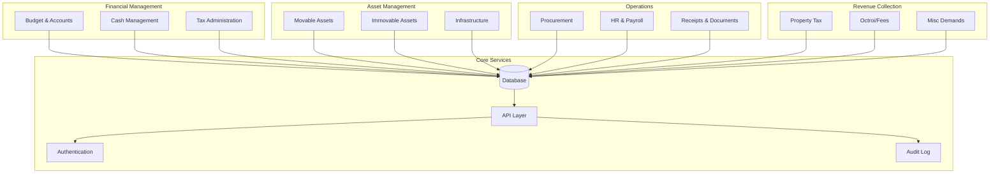

# High-Level Architecture: Gram Panchayat Namunas System

## Executive Summary

This document outlines the architecture for a comprehensive digital system to manage all 33 namunas (forms/registers) used in Maharashtra's Gram Panchayat administration. The system will digitize financial records, asset management, tax collection, payroll, and various administrative registers.

---

## System Overview

### Core Modules (Grouped by Function)



---

## Database Architecture

### Schema Design Strategy

**Approach:** Hybrid model combining:
1. **Core Tables** for each namuna
2. **Common Metadata Tables** for shared entities
3. **Flexible Field Extensions** for future customization

### Core Entity Groups

#### 1. Financial Management Group

**Namunas 1-6: Budget & Accounts**

```sql
-- Namuna 1: Budget (Income & Expenditure)
Table: budgets
- id, gram_panchayat_id, financial_year
- status (draft, approved, revised)
- created_at, updated_at

Table: budget_income_items
- id, budget_id, serial_no, head_of_receipt
- previous_year_actual, current_sanctioned, current_revised, next_estimate
- category (tax, grants, fees, etc.)

Table: budget_expenditure_items
- id, budget_id, serial_no, head_of_expenditure
- previous_year_actual, current_sanctioned, current_revised, next_estimate
- department, category

-- Namuna 2: Re-appropriation
Table: reappropriations
- id, budget_id, date, approval_ref
- from_major_head, from_minor_head, from_amount
- to_major_head, to_minor_head, to_amount
- reason, status

-- Namuna 3 & 4: Annual Accounts (Receipts & Expenditure)
Table: annual_accounts
- id, gram_panchayat_id, financial_year, type (receipt/expenditure)
- opening_balance, closing_balance
- generated_at

Table: account_line_items
- id, annual_account_id, head, budget_estimate, actual_amount, variance

-- Namuna 5: General Cashbook
Table: cashbook_entries
- id, gram_panchayat_id, entry_date, serial_no
- transaction_type (receipt/payment)
- party_name, description
- receipt_no / voucher_no
- head_of_account, amount
- created_by, verified_by

-- Namuna 6: Classified Register
Table: classified_accounts
- id, gram_panchayat_id, financial_year, month
- head_of_account, budget_grant
- day_1 through day_31 (daily amounts)
- monthly_total, progressive_total
```

#### 2. Revenue Collection Group

**Namunas 7-13: Tax & Fee Collection**

```sql
-- Namuna 7: General Receipt
Table: receipts
- id, receipt_book_id, receipt_no, date
- received_from, on_account_of, amount
- payment_mode, reference_no
- issued_by, cancelled (boolean)

-- Namuna 8: Assessment List (Property Tax)
Table: property_assessments
- id, gram_panchayat_id, assessment_year
- serial_no, street_name, property_no
- property_description, owner_name, occupier_name
- annual_rental_value, tax_rate, total_tax
- status (active/inactive)

-- Namuna 9: Register of Demand
Table: tax_demands
- id, property_assessment_id, circle, financial_year
- taxpayer_name, arrears_amount, current_year_demand
- total_demand, collected_amount, balance

-- Namuna 10: Tax Bill
Table: tax_bills
- id, tax_demand_id, bill_no, bill_date
- taxpayer_name, bill_amount, due_date
- payment_status, paid_date, receipt_id

-- Namuna 11: Miscellaneous Demands
Table: misc_demands
- id, gram_panchayat_id, serial_no
- payer_name, nature_of_demand, authority_ref
- installment_amount, total_amount
- status (pending/partial/paid)

Table: misc_demand_recoveries
- id, misc_demand_id, receipt_no, recovery_date, amount, balance

-- Namuna 12 & 13: Octroi
Table: octroi_receipts
- id, naka_name, receipt_no, date
- importer_name, goods_description
- weight_or_count, value, tax_rate, tax_amount

Table: octroi_collection_register
- id, challan_no, date, receipt_id
- daily_total, monthly_total
```

#### 3. Operations Group

**Namunas 15-18, 21, 24: Procurement & HR**

```sql
-- Namuna 15: Register of Purchases
Table: purchases
- id, gram_panchayat_id, purchase_date
- supplier_name, bill_no, bill_date
- total_amount, payment_status

Table: purchase_items
- id, purchase_id, item_name, quantity, unit, rate, amount

-- Namuna 16 & 24: Staff Salaries
Table: employees
- id, gram_panchayat_id, employee_code
- name, designation, pay_scale, join_date
- status (active/resigned/retired)

Table: salary_payments
- id, employee_id, month, year
- basic_pay, da, hra, other_allowances
- pf_deduction, tax_deduction, other_deductions
- net_pay, payment_date, signature_path

-- Namuna 17: Stamp Account
Table: stamp_inventory
- id, gram_panchayat_id, date
- opening_stock, received_count, received_value
- used_count, used_value, letter_refs
- closing_stock

-- Namuna 18: Receipt Book Register
Table: receipt_book_inventory
- id, gram_panchayat_id, book_type
- opening_stock, received_stock, issued_to
- issue_date, closing_stock

-- Namuna 21: Petty Cash
Table: petty_cash_transactions
- id, gram_panchayat_id, date, voucher_no
- transaction_type (receipt/payment)
- party_name, particulars, amount
```

#### 4. Asset Management Group

**Namunas 19, 25-27: Assets & Infrastructure**

```sql
-- Namuna 19: Dead Stock (Movable Assets)
Table: movable_assets
- id, gram_panchayat_id, serial_no
- asset_description, category (furniture, electronics, vehicles)
- purchase_authority, purchase_date, quantity, price
- current_location, condition
- disposal_date, disposal_amount, disposal_reason

-- Namuna 25: Immovable Property
Table: immovable_properties
- id, gram_panchayat_id
- property_type (building, land)
- acquisition_date, acquisition_cost, location
- area, survey_no, valuation_date
- current_value, depreciation
- disposal_date, disposal_amount

-- Namuna 26: Roads Register
Table: roads
- id, gram_panchayat_id, road_name
- start_point, end_point, length
- surface_type (mud, gravel, concrete, asphalt)
- construction_date, construction_cost
- last_maintenance_date, condition_status

-- Namuna 27: Land Acquired
Table: acquired_lands
- id, gram_panchayat_id, acquisition_date
- purpose, acquired_from, area
- compensation_amount, survey_no
- current_usage, status
```

#### 5. Project Management Group

**Namuna 23: Work Estimates**

```sql
Table: work_estimates
- id, gram_panchayat_id, serial_no
- work_title, work_category
- sanctioning_authority, sanction_date, sanction_ref
- estimated_cost, approved_cost
- status (proposed, approved, in_progress, completed)

Table: estimate_line_items
- id, work_estimate_id, item_description
- unit, quantity, rate, amount
```

#### 6. Investment Management

**Investment Registers (Part of financial management)**

```sql
Table: investments
- id, gram_panchayat_id, investment_type (shares, bonds)
- society_name / bond_issuer, purchase_date
- certificate_no, quantity_or_face_value
- purchase_price, interest_rate
- maturity_date, current_value
- withdrawal_date, sale_price
```

---

### Common/Shared Tables

```sql
-- Master Data
Table: gram_panchayats
- id, name, code, district, taluka
- address, population, formation_date
- contact_info, sarpanch_id

Table: financial_years
- id, year_code (e.g., "2025-26")
- start_date, end_date, status

Table: users
- id, username, password_hash, role
- gram_panchayat_id, employee_id
- email, phone, status, last_login

Table: roles_permissions
- role_id, module_name, can_create, can_read, can_update, can_delete

-- Audit & Logs
Table: audit_logs
- id, user_id, action, table_name, record_id
- old_value, new_value, timestamp, ip_address

Table: document_attachments
- id, entity_type, entity_id, document_type
- file_path, file_name, uploaded_by, uploaded_at

-- Configuration
Table: namuna_configurations
- id, namuna_no, namuna_name_en, namuna_name_mr
- is_active, category, display_order
- custom_fields_json (for extensibility)
```

---

## Business Logic Layer

### Module Structure

```
src/
├── modules/
│   ├── financial/
│   │   ├── budget.service.js
│   │   ├── cashbook.service.js
│   │   ├── accounts.service.js
│   │   └── reappropriation.service.js
│   ├── revenue/
│   │   ├── property-tax.service.js
│   │   ├── octroi.service.js
│   │   ├── receipts.service.js
│   │   └── misc-demands.service.js
│   ├── operations/
│   │   ├── procurement.service.js
│   │   ├── payroll.service.js
│   │   └── inventory.service.js
│   ├── assets/
│   │   ├── movable-assets.service.js
│   │   ├── immovable-assets.service.js
│   │   └── infrastructure.service.js
│   ├── projects/
│   │   └── work-estimates.service.js
│   └── reports/
│       └── namuna-reports.service.js
├── common/
│   ├── auth/
│   ├── validation/
│   ├── utils/
│   └── middleware/
└── config/
```

### Key Service Patterns

#### 1. Namuna Service Base Class

```javascript
class NamunaBaseService {
  constructor(namunaConfig) {
    this.namunaNo = namunaConfig.number;
    this.namunaName = namunaConfig.name;
    this.tableName = namunaConfig.tableName;
  }
  
  // CRUD Operations
  async create(data, userId) { }
  async findById(id) { }
  async findAll(filters, pagination) { }
  async update(id, data, userId) { }
  async delete(id, userId) { }
  
  // Common Operations
  async validate(data) { }
  async generateReport(filters) { }
  async export(format, filters) { }
  async audit(action, recordId, changes, userId) { }
}
```

#### 2. Financial Validation Rules

```javascript
class FinancialValidationService {
  // Ensure budget balances (Income = Expenditure)
  validateBudgetBalance(income, expenditure) { }
  
  // Validate reappropriation doesn't exceed available funds
  validateReappropriation(fromHead, amount) { }
  
  // Ensure cashbook entries match classified accounts
  validateCashbookReconciliation(month, year) { }
  
  // Validate tax calculations
  validatePropertyTaxCalculation(assessment) { }
}
```

#### 3. Integration Services

```javascript
class IntegrationService {
  // Auto-create entries across related namunas
  recordPayment(receiptData) {
    // 1. Create receipt (Namuna 7)
    // 2. Update cashbook (Namuna 5)
    // 3. Update classified register (Namuna 6)
    // 4. Update demand register (Namuna 9 or 11)
    // 5. Generate tax bill if needed (Namuna 10)
  }
  
  recordPurchase(purchaseData) {
    // 1. Create purchase entry (Namuna 15)
    // 2. Update cashbook (Namuna 5)
    // 3. Update asset register if applicable (Namuna 19)
  }
}
```

---

## API Architecture

### RESTful API Structure

```
/api/v1/
├── auth/
│   ├── POST /login
│   ├── POST /logout
│   └── GET /profile
├── namunas/
│   ├── GET / (list all namunas)
│   ├── GET /:namunaNo/config
│   └── GET /:namunaNo/metadata
├── budget/
│   ├── GET /years/:year
│   ├── POST /
│   ├── PUT /:id
│   ├── POST /:id/approve
│   ├── GET /:id/income-items
│   ├── GET /:id/expenditure-items
│   └── GET /:id/report
├── cashbook/
│   ├── GET /entries
│   ├── POST /entries
│   ├── GET /entries/:id
│   ├── GET /daily-summary/:date
│   └── GET /monthly-summary/:month/:year
├── property-tax/
│   ├── GET /assessments
│   ├── POST /assessments
│   ├── GET /assessments/:id
│   ├── GET /demands
│   ├── POST /bills/generate
│   └── POST /payments/record
├── receipts/
│   ├── GET /
│   ├── POST /
│   ├── GET /:id
│   ├── GET /:id/pdf
│   └── POST /:id/cancel
├── employees/
│   ├── GET /
│   ├── POST /
│   ├── GET /:id
│   ├── GET /:id/salary-history
│   └── POST /salary/process/:month/:year
├── assets/
│   ├── GET /movable
│   ├── GET /immovable
│   ├── GET /roads
│   ├── GET /acquired-lands
│   ├── POST /movable
│   └── GET /:id/depreciation
├── reports/
│   ├── GET /namuna/:namunaNo
│   ├── GET /financial-summary/:year
│   ├── GET /tax-collection/:period
│   └── GET /custom
└── admin/
    ├── GET /audit-logs
    ├── GET /users
    └── POST /backup
```

### API Response Format

```json
{
  "success": true,
  "data": { },
  "meta": {
    "timestamp": "2026-02-03T15:30:00+05:30",
    "version": "1.0",
    "pagination": {
      "page": 1,
      "pageSize": 20,
      "totalRecords": 100,
      "totalPages": 5
    }
  },
  "errors": []
}
```

---

## Technology Stack Recommendations

### Backend
- **Framework:** Node.js with Express / Python with FastAPI / Java with Spring Boot
- **Database:** PostgreSQL (primary), with read replicas for reporting
- **ORM:** Sequelize / Prisma (Node.js), SQLAlchemy (Python), Hibernate (Java)
- **Caching:** Redis for session management and frequently accessed data
- **File Storage:** Local file system / AWS S3 for document attachments

### Frontend
- **Framework:** React.js / Vue.js / Angular
- **State Management:** Redux / Vuex
- **UI Library:** Material-UI / Ant Design / Tailwind CSS
- **Forms:** Formik/React Hook Form with Yup validation
- **Reporting:** React-PDF / jsPDF for PDF generation

### DevOps
- **Containerization:** Docker
- **CI/CD:** GitHub Actions / GitLab CI
- **Monitoring:** Prometheus + Grafana
- **Logging:** ELK Stack (Elasticsearch, Logstash, Kibana)

---

## Key Features & Capabilities

### 1. Data Integrity & Validation
- Cross-namuna validation (e.g., cashbook must reconcile with classified register)
- Budget constraint enforcement
- Duplicate entry prevention
- Financial year lock after audit approval

### 2. Automation
- Auto-populate related entries across multiple namunas
- Scheduled report generation
- Tax bill generation
- Salary calculation automation
- Email/SMS notifications for due dates

### 3. Reporting & Analytics
- Pre-configured reports for all 33 namunas
- Custom report builder
- Financial dashboards
- Tax collection analytics
- Comparative analysis (year-over-year)
- Export to Excel, PDF, CSV

### 4. Security
- Role-based access control (RBAC)
- Multi-level approval workflows
- Complete audit trail
- Data encryption at rest and in transit
- Session management with timeout
- IP whitelisting for admin functions

### 5. Multi-language Support
- English and Marathi UI
- Bilingual report generation
- Transliteration support for input fields

### 6. Offline Capability
- Progressive Web App (PWA) for offline data entry
- Sync mechanism when connection is restored
- Conflict resolution for concurrent edits

---

## Extensibility Strategy

### Adding Custom Fields

```sql
-- Option 1: JSON columns for flexibility
Table: budget_income_items
- custom_fields JSON

-- Option 2: Key-value store
Table: custom_field_values
- entity_type, entity_id, field_name, field_value, field_type
```

### Namuna Configuration

```json
{
  "namunaNo": 1,
  "namunaNameEn": "Budget Estimate",
  "namunaNameMr": "अंदाजपत्रक",
  "tables": ["budgets", "budget_income_items", "budget_expenditure_items"],
  "customFields": [
    {
      "fieldName": "project_code",
      "fieldType": "string",
      "required": false,
      "validation": "alphanumeric"
    }
  ],
  "permissions": {
    "create": ["admin", "accountant"],
    "approve": ["sarpanch", "admin"]
  }
}
```

---

## Implementation Phases

### Phase 1: Core Financial Management (Namunas 1-6)
- Budget management
- Cashbook and classified accounts
- Basic reporting

### Phase 2: Revenue Collection (Namunas 7-13)
- Property tax assessment and billing
- Receipt generation
- Demand registers
- Octroi management

### Phase 3: Operations (Namunas 15-18, 21, 24)
- Procurement and purchase tracking
- Payroll and salary management
- Inventory management (stamps, receipt books)
- Petty cash

### Phase 4: Asset Management (Namunas 19, 25-27)
- Movable and immovable asset registers
- Infrastructure tracking (roads, lands)
- Depreciation calculation

### Phase 5: Advanced Features
- Work estimate management (Namuna 23)
- Investment tracking
- Advanced analytics and dashboards
- Mobile application
- Integration with state government systems

---

## Success Metrics

- **Data Accuracy:** 99.9% reconciliation across related namunas
- **User Adoption:** 80% of Gram Panchayats using the system within 1 year
- **Performance:** Page load time < 2 seconds, API response time < 200ms
- **Availability:** 99.5% uptime
- **Audit Compliance:** 100% audit trail coverage
- **Training:** All users trained within first month of deployment

---

## Next Steps

1. **Database Schema Refinement:** Add detailed field specifications from namunas.txt
2. **Entity Relationship Diagram:** Create detailed ERD showing all relationships
3. **API Documentation:** OpenAPI/Swagger specification
4. **UI/UX Wireframes:** Design mockups for each namuna interface
5. **Proof of Concept:** Build core modules (Budget + Cashbook + Receipts) for validation
